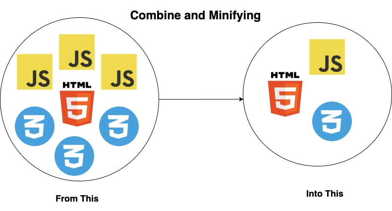

<h1 align="right">بِسْمِ اللهِ الرَّحْمٰنِ الرَّحِيْمِ</h1>

# ABOUT

<p>
<b>Lotek</b> is a Script (Joiner / Combiner / Minifier) for <b>HTML, CSS and JavaScript</b>. Pretty helpfull for building asset bundle script into One Small File.
</p>

<p>
<b>Lotek</b> is not <b>WebPack</b>. But it has some similiarity. 
While <b>WebPack</b> is for Modular Project. <br />
<b>Lotek</b> is a script combiner for Basic JS (Think like jQuery, Bootstrap, etc...). 

in example if you have this code in your HTML files : 
```html
<html>
<body>
<!-- ..... -->
    <!-- Because i use jquery a lot, 
    even if I use modern framework like Svelte, Vue, etc.. 
    I still need to include jQuery (Because it has so many library :D ) -->
    <script src="./jquery.min.js"></script>
    <script src="./bootstrap.min.js"></script>
    <script src="https://somecdn.com/somejquerylibrary.min.js"></script>
    <script src="./yourlibscript.js"></script>
    <script src="./anotherscript.js"></script>
    <script src="./anotherscript2.js"></script>
    <script src="./yourwebpackscript.min.js"></script>
<!-- ..... -->
</body>
</html>
```
In my case, that code is affecting page speed load performance because browser will try to download all those script.

<b>Lotek</b> will combine them into 1 script file and make page load much faster and efficient. And also it will make code more simple like this : 
```html
<html>
<body>
<!-- ..... -->
    <script src="./lotek.bundle.min.js"></script>
    <script src="./yourwebpackscript.min.js"></script>
<!-- ..... -->
</body>
</html>
```

</p>

Just give it a try, and you'll love it so much.

#### Author

Crafted with :heart: by [Herlangga Sefani (a.k.a Gaibz)](https://github.com/gaibz) 

<hr />

# HOW TO'S 

### Installation
```
> npm install lotek --save-dev
```

### Usage

In `joiner.js` file
```javascript
const Lotek = require("lotek");

const config = {
    groups : [
            {
                // specify group name, for identifier
                name : "Production",
                // if true, then it will print out file location information inside output file
                debug_mode : true,
                // configuration for JS File
                js : {
                    files : [
                        "https://ajax.googleapis.com/ajax/libs/jquery/3.5.1/jquery.min.js",
                        "./assets/src/js/script1.js",
                        "./assets/src/js/script2.js"
                    ],
                    output : "./assets/dist/bundle.assets.production.min.js",
                    // if true then content of file will be inside a javascript closure function. ()()
                    use_closure_per_file : false,
                    // if true then content of all file will be inside javascript closure function
                    use_closure_all : false,
                    // compress output into minified version
                    minify : true,
                    // @see : <https://www.npmjs.com/package/terser#compress-options>
                    minify_options : {}
                },
                // Configuration for CSS Files
                css : {
                    files : [
                        "https://netdna.bootstrapcdn.com/bootstrap/3.0.0/css/bootstrap-glyphicons.css",
                        "https://cdnjs.cloudflare.com/ajax/libs/bootstrap-fileinput/5.1.1/css/fileinput.min.css",
                        "./assets/src/css/style1.css",
                        "./assets/src/css/style2.css"
                    ],
                    output : "./assets/dist/bundle.assets.production.min.css",
                    // For Css This is important, as inside of css files may contain url() linked to another directory
                    url_replaces : [
                        {
                            find : "assets/",
                            replacement : "../"
                        },
                        // ... more
                    ],
                    // Replace Log Output Filepath
                    replace_log_output : "./replacer_log.txt",
                    // compress output into minified version
                    minify : true,
                    // @see https://github.com/jakubpawlowicz/clean-css#constructor-options
                    minify_options: {
                        // format: 'beautify'
                    }
                },
                
                // Configuration for HTML File
                html : {
                    files : [
                        "./dev.html"
                    ],
                    output : "./index.html",
                    // you may want to change some code inside html for joining
                    replaces : [
                        {
                            find : `<link href="./assets/src/css/style1.css" rel="stylesheet" />`,
                            replacement : `<link href='./assets/dist/bundle.assets.production.min.css' rel='stylesheet' />`,
                        },
                        {
                            find : `<link href="./assets/src/css/style2.css" rel="stylesheet" />`,
                            replacement : "",
                        },
                        {
                            find : `<script src="./assets/src/js/script1.js"></script>`,
                            replacement : `<script src="./assets/dist/bundle.assets.production.min.js"></script>`,
                        },
                        {
                            find : `<script src="./assets/src/js/script2.js"></script>`,
                            replacement : "",
                        },
                        // ... more
                    ],
                    // minify html using html-minifier
                    minify : true,
                    // @see https://www.npmjs.com/package/html-minifier#options-quick-reference
                    minify_options : {
                        removeAttributeQuotes: true,
                        removeComments : true,
                        collapseWhitespace : true,
                        minifyJS : true,
                        minifyCSS : true,
                    }
                }
   
            }
        ]
}

new Lotek(config).compile().then(() => {
    console.log("Done.");
}); 
```
Then Simply run in command line
```
> node joiner.js
```

<hr />

# Configuration
<hr />
<b>groups[] [Array]</b><br /> Groups is an array of multiple config to be bundled. <hr />

<b>groups[].name [String]</b><br /> 
Specify Group name for identifier, example : Production, Development, or anything you want. <hr />

<b>groups[].debug_mode [Boolean]</b><br /> 
If set to true, then it will print out file source location inside output file on top of code. <br />
ex : `/*! File : somedir/somefile.ext */`
<hr />

#### Configuration for JS Files
<hr />
<b>groups[].js [Object]</b><br /> 
Object of javascript bundle configuration
<hr />

<b>groups[].js.files [Array]</b><br /> 
Array of files to be bundled, you can put url from http / https
<hr />

<b>groups[].js.output [String]</b><br /> 
Output file of combined and minified javascript code
<hr />

<b>groups[].js.use_closure_per_file [Boolean]</b><br /> 
if true then it will make closure per file code, see example output
```javascript
/*! Code of original file1.js */
console.log("File 1");
/*! Code of original file2.js */
console.log("File 1");


/*! Code of output with closure per file set to true */
(() => {
    console.log("File 1");
})();
(() => {
    console.log("File 2");
})();
```
<hr />

<b>groups[].js.use_closure_all [Boolean]</b><br /> 
if true then it will make closure per file code, see example output
```javascript
/*! Code of original file1.js */
console.log("File 1");
/*! Code of original file2.js */
console.log("File 1");


/*! Code of output with closure all set to true */
(() => {
    console.log("File 1");
    console.log("File 2");
})();
```
<hr />


<b>groups[].js.minify [Boolean]</b><br /> 
if true then it will minify the output of all code (Powered by [Terser](https://www.npmjs.com/package/terser)),  
see example output
```javascript
/*! Code of original file1.js */
console.log("File 1");
/*! Code of original file2.js */
console.log("File 1");


/*! Code of output with minify to true */
console.log("File 1");console.log("File 2");
```
<hr />

<b>groups[].js.minify_options [Object]</b><br /> 
Since I used Terser for minify, please visit [Terser Options](https://www.npmjs.com/package/terser#compress-options) for better explanation
<hr />


#### Configuration for CSS Files
<hr />


<b>groups[].css [Object]</b><br /> 
Object of CSS (Cascading StyleSheet) bundle configuration
<hr />

<b>groups[].css.files [Array]</b><br /> 
Array of files to be bundled, you can put url from http / https
<hr />

<b>groups[].css.output [String]</b><br /> 
Output file of combined and minified css
<hr />

<b>groups[].css.url_replaces [Array of Object]</b><br /> 
For CSS Sometimes you need to specify the path of assets inside CSS, this thing will act like url translator.<br /> 
For example inside an `@import url(...)` or `background:url(...)` <br />
With this configuration it will automatically detect your asset url and refactor into new url by specify `find` and `replacement`. <br />
the Object should contain : `find` and `replacement` key.

If you have a css file like this (./assets/src/css/style.css) : 
```css
/*! Example of CSS */
body {
    background:url('./images/someimage.png');
}
```

and you set the config like this (./joiner.js): 
```javascript
/*! Config example */
css = {
    files : [
        "./assets/src/css/style.css"
    ],
    output : "./assets/dist/bundle.css",
    url_replaces : [
        {
            find : "assets/",
            replacement : "../"        
        }
    ]
}
```

And the output of CSS should be : 
```css
/*! 
Without url_replace is set, which will give you wrong path 
*/
body {
    background:url('./assets/src/css/./images/someimage.png');
}

/*! 
With url_replace is set  will give you correct path 
*/
body {
    background:url('./../src/css/./images/someimage.png');
}

/*! 
With url_replace is set and minified
*/
body {
    background:url('../src/css/images/someimage.png');
}
```

<hr />

<b>groups[].css.replace_log_output [String]</b><br /> 
output file for saving replace log
<hr />


<b>groups[].css.minify [Boolean]</b><br /> 
if true then it will minify the output of all code (Powered by [Clean-CSS](https://github.com/jakubpawlowicz/clean-css)),  
see example output
```css
/*! Code of original style1.css */
body {
    cursor: pointer;
    background: url('./images/sample1.png');
}
/*! Code of original style2.css */
body {
    border: 1px solid #ddd;
}


/*! Code of output with minify to true */
body{cursor:pointer;background:url(../src/css/images/sample1.png)}body{border:1px solid #ddd}
```
<hr />

<b>groups[].css.minify_options [Object]</b><br /> 
Since I used Clean-CSS for minify, please visit [Clean CSS Options](https://github.com/jakubpawlowicz/clean-css#constructor-options) for better explanation
<hr />


#### Configuration for HTML Files
<hr />


<b>groups[].html [Object]</b><br /> 
Object of HTML bundle configuration
<hr />

<b>groups[].html.files [Array]</b><br /> 
Array of files to be bundled, you can put url from http / https
<hr />

<b>groups[].html.output [String]</b><br /> 
Output file of combined and minified html
<hr />

<b>groups[].css.replaces [Array of Object]</b><br /> 
Find and Replace content inside HTML. This is usefull if you want to automatically change source script for development and production. 
Just see example (dev.html) :  
```html
<!DOCTYPE html>
<html lang="en">
<head>
    <meta charset="UTF-8">
    <title>Some Title</title>
    <link href="./assets/src/css/style1.css" rel="stylesheet" />
    <link href="./assets/src/css/style2.css" rel="stylesheet" />
</head>
<body>
    <script src="./assets/src/js/script1.js"></script>
    <script src="./assets/src/js/script2.js"></script>
</body>
</html>
```

and you set the config like this (./joiner.js): 
```javascript
/*! Config example */
html = {
    files : [
        "./dev.html"
    ],
    output : "./index.html",
    replaces : [
        {
            find : `<link href="./assets/src/css/style1.css" rel="stylesheet" />`,
            replacement : `<link href='./assets/dist/bundle.assets.production.min.css' rel='stylesheet' />`,
        },
        {
            find : `<link href="./assets/src/css/style2.css" rel="stylesheet" />`,
            replacement : "",
        },
        {
            find : `<script src="./assets/src/js/script1.js"></script>`,
            replacement : `<script src="./assets/dist/bundle.assets.production.min.js"></script>`,
        },
        {
            find : `<script src="./assets/src/js/script2.js"></script>`,
            replacement : "",
        },    
    ]
}
```

And the output of HTML should be : 
```html
<!-- File : ./dev.html --> 
<!DOCTYPE html>
<html lang="en">
<head>
    <meta charset="UTF-8">
    <title>Some Title</title>
    <link href='./assets/dist/bundle.assets.production.min.css' rel='stylesheet' />
    
</head>
<body>
    <script src="./assets/dist/bundle.assets.production.min.js"></script>
    
</body>
</html>
```

<hr />

<b>groups[].html.minify [Boolean]</b><br /> 
if true then it will minify the output of all code (Powered by [html-minifier](https://www.npmjs.com/package/html-minifier)).
<hr />

<b>groups[].html.minify_options [Object]</b><br /> 
Since I used html-minifier for minify, please visit [HTML Minifier Options](https://www.npmjs.com/package/html-minifier#options-quick-reference) for better explanation
<hr />

## Contributors 

Thanks to all of these wonderfull people who make this project awesome.

<!-- ALL-CONTRIBUTORS-LIST:START - Do not remove or modify this section -->
<!-- prettier-ignore-start -->
<!-- markdownlint-disable -->
<table>
  <tr>
    <td align="center"><a href="https://github.com/gaibz"><br /><sub><b>Herlangga Sefani</b></sub></a><br /><a href="https://github.com/gaibz/Lotek/commits?author=gaibz" title="Code">💻</a></td>
    <td align="center"><a href="https://github.com/RayhanHamada"><br /><sub><b>Mocchapine</b></sub></a><br /><a href="https://github.com/gaibz/Lotek/commits?author=RayhanHamada" title="Code">💻</a></td>
  </tr>
</table>

<!-- markdownlint-restore -->
<!-- prettier-ignore-end -->

<!-- ALL-CONTRIBUTORS-LIST:END -->